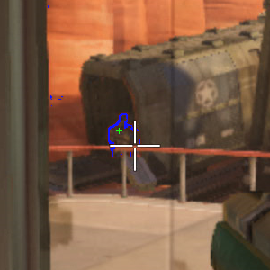
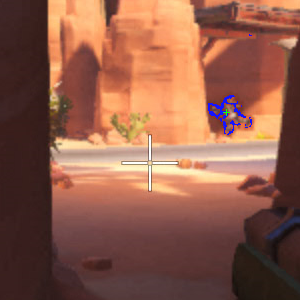
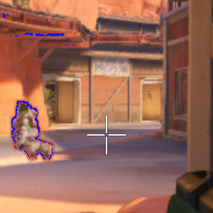
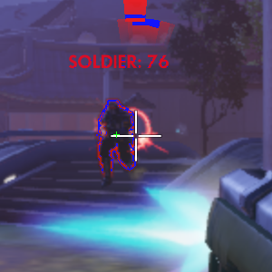
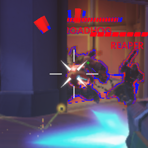
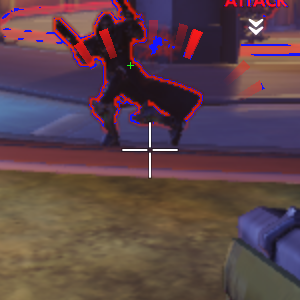
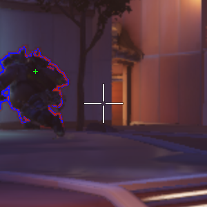
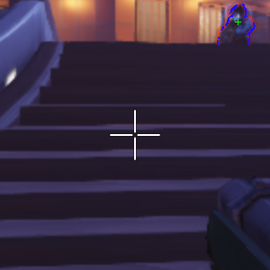

# POC-AimBot-Overwatch

POC aimbot ("auto-aim") on the game Overwatch.

**Note: This program has not been used during a real game of Overwatch. Demonstrations (images and videos) were performed on video recordings of games.**

**Update: The source files of this repository have been removed after an agreement with the Blizzard Company.**

## Overall functioning

This script uses the Python library *PIL* to recover the center of the main screen (as the sight of the gun is always at this position). A aimbot is mainly there for the accuracy, it is unnecessary to make treatments across the entire screenshot: the captured area is only 300x300 pixels (it also helps to reduce the computation times).

Enemy players on Overwatch are surrounded by a red border; treatments are therefore to detect these areas, then choose the closest. A simple cursor movement then enough to target the enemy player.

## Demonstrations

Examples of detected zones and the position selected as a target:

## Major concerns faced

